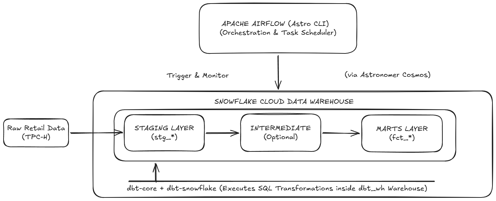

<div align="center">
  <h1>Airflow dbt Snowflake Pipeline 🚀❄️</h1>
  <p><em>A production-ready ELT Data Pipeline orchestrating dbt transformations inside Snowflake via Apache Airflow</em></p>

  []()
  []()
  []()
  []()
  []()
</div>

---

## 📖 Project Overview

This project implements a **Modern Data Stack (MDS)** utilizing a fully automated **ELT Data Pipeline**. The system extracts raw retail sample data (TPC-H), loads it into the **Snowflake** Cloud Data Warehouse, and leverages **dbt-core** to perform robust data modeling following the Medallion Architecture. The entire workflow is dynamically orchestrated and monitored through **Apache Airflow** via Astronomer Cosmos.

### Key Features
- **Modern ELT Workflow**: Strict decoupling between the storage/compute layer (Snowflake) and the orchestration layer (Airflow).
- **Medallion Data Architecture**: Structuring data transformation pipelines across Staging (`stg_`) and Marts (`fct_`) layers for optimized BI readiness.
- **Dynamic Task Generation**: Utilizes *Astronomer Cosmos* to automatically parse the dbt project into modular Airflow DAG tasks dynamically, eliminating manual Python DAG code maintenance.
- **Advanced Transformations**: Integrated the `dbt_utils` extension package to streamline complex string manipulations and computational logic.
- **Isolated Environment**: Runs dbt within an isolated Python virtual environment (`dbt_venv`) inside the Airflow Docker container to prevent dependency conflicts.

---

## 🛠️ Tech Stack & Architecture

<div align="center">
  
</div>

| Layer | Component | Technology | Description |
| :--- | :--- | :---: | :--- |
| **Storage & Compute** | Data Warehouse | ❄️ Snowflake | Stores raw TPC-H data and executes heavy SQL computational transformation workloads triggered by dbt. |
| **Transform** | Data Modeling | 🔨 dbt-core + dbt-snowflake | Reads raw ingestion layers, processes business logic through multiple stages, and materializes final Views/Tables in Snowflake. |
| **Orchestration** | Scheduler | 🌬️ Apache Airflow | Automatically schedules, parses dbt project lineages, and triggers daily pipeline executions. |
| **Infrastructure** | Container | 🐳 Docker & Astro CLI | Packages the Airflow Webserver, Scheduler, and Triggerer environments for consistent executions across any machine. |

---

## 📂 Project Structure

```text
dbt-snowflake-data-pipeline/
├── dags/
│   ├── dbt_dags.py               # Airflow DAG configuration file coordinating dbt execution
│   └── dbt/
│       └── data_pipeline/        # Root folder of the dbt project
│           ├── dbt_project.yml   # Main dbt configuration file
│           ├── packages.yml      # Third-party package declarations (dbt_utils)
│           ├── models/           # SQL data transformation models directory
│           │   ├── staging/      # Staging layer models (stg_tpch_orders.sql, etc.)
│           │   └── marts/        # Marts layer containing refined fact models (fct_orders.sql)
│           └── seeds/            # Static data storage for manual CSV seed loads
├── dbt_venv/                     # Isolated Python virtual environment containing dbt-core & dbt-snowflake
├── Dockerfile                    # Docker configuration setup to build consistent Airflow container runtimes
└── .gitignore                    # Prevents build artifacts and sensitive credentials (profiles.yml) from being tracked
```
## 🚀 Getting Started
1. Local Environment Preparation
From the project root directory, activate the Python virtual environment and pull the required external dbt dependency packages locally:

     ./dbt_venv/bin/dbt deps --project-dir dags/dbt/data_pipeline

2. Infrastructure Setup & Access Control on Snowflake
Open your Snowflake Worksheet console and execute the following SQL script using the ACCOUNTADMIN role to initialize your warehouse computing power and handle schema privilege boundaries (future privileges). This ensures dbt can seamlessly materialize models without access blockages:
    
    USE ROLE ACCOUNTADMIN;

    CREATE WAREHOUSE IF NOT EXISTS dbt_wh WITH WAREHOUSE_SIZE='x-small';
    CREATE DATABASE IF NOT EXISTS dbt_db;
    CREATE ROLE IF NOT EXISTS dbt_role;

    GRANT ROLE dbt_role TO USER AOMINHTAM;
    GRANT USAGE ON WAREHOUSE dbt_wh TO ROLE dbt_role;
    GRANT ALL ON DATABASE dbt_db TO ROLE dbt_role;

    -- Grant future object access within the schema to ACCOUNTADMIN for seamless orchestration
    GRANT ALL PRIVILEGES ON SCHEMA DBT_DB.DBT_SCHEMA TO ROLE ACCOUNTADMIN;
    GRANT ALL PRIVILEGES ON FUTURE TABLES IN SCHEMA DBT_DB.DBT_SCHEMA TO ROLE ACCOUNTADMIN;
    GRANT ALL PRIVILEGES ON FUTURE VIEWS IN SCHEMA DBT_DB.DBT_SCHEMA TO ROLE ACCOUNTADMIN;

3. Launching the Orchestration on Airflow
Spin up your local isolated Airflow container cluster using the Astronomer CLI:

    astro dev start

| Service | Access Link / Endpoint | Credentials / Role |
| :--- | :--- | :--- |
| **Airflow Webserver** | `http://localhost:8080` *(Default port mapped via Astro CLI)* | Administrator (Internal Account) |
| **Snowflake Console** | `https://bs54698.ap-southeast-7.aws.snowflakecomputing.com` | Personal Account: `AOMINHTAM` / Role: `dbt_role` |

## 📝 Troubleshooting Highlights
Broken DAG (Docker Absolute Path Misconfiguration): Fixed the Cosmos library absolute path mismatch that occurred during container runtime by explicitly mapping the setup directory path directly to /usr/local/airflow/dags/dbt/data_pipeline.

Compilation Error (Missing dbt_utils package dependency): Resolved macro loading errors by shifting the packages.yml file to the correct root dbt sub-project directory and running localized dbt deps to properly bundle extensions.

SQL Access Control Error (Snowflake Error 003001): Rectified schema ownership assignment conflicts arising between dbt_role and ACCOUNTADMIN by directly setting up continuous FUTURE TABLES/VIEWS privileges on the target Snowflake database.

---

## 🤝 Acknowledgments

Special thanks to **Tu Nguyen** and the data engineering community on **YouTube** for their invaluable tutorials, guidance, and technical support throughout the implementation and debugging of this modern data pipeline project.
